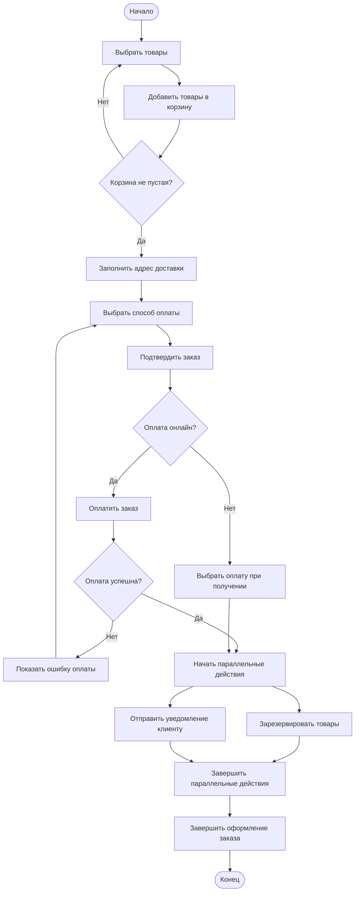

# Диаграмма деятельности: оформление заказа в интернет-магазине

## Описание процесса

Диаграмма деятельности показывает процесс оформления заказа в интернет-магазине.

Пользователь выбирает товары, добавляет их в корзину, заполняет адрес доставки, выбирает способ оплаты и подтверждает заказ. После этого система проверяет оплату, резервирует товары и отправляет уведомление клиенту.

---

## Диаграмма Mermaid



---

## Пояснение к диаграмме

1. Процесс начинается с выбора товаров.
2. Пользователь добавляет товары в корзину.
3. Система проверяет, не пустая ли корзина.
4. Если корзина пустая, пользователь возвращается к выбору товаров.
5. Если корзина не пустая, пользователь вводит адрес доставки.
6. Пользователь выбирает способ оплаты.
7. Пользователь подтверждает заказ.
8. Если выбрана онлайн-оплата, система проверяет успешность платежа.
9. Если оплата не прошла, пользователь возвращается к выбору способа оплаты.
10. Если оплата успешна или выбрана оплата при получении, выполняются параллельные действия.
11. Система резервирует товары и отправляет уведомление клиенту.
12. После завершения параллельных действий заказ считается оформленным.

---

## Код процесса на Python

```python
cart = ["Ноутбук", "Мышь"]
payment_type = "online"
payment_success = True

if len(cart) == 0:
    print("Корзина пустая. Нужно выбрать товары.")
else:
    print("Товары добавлены в корзину")
    print("Адрес доставки заполнен")
    print("Заказ подтвержден")

    if payment_type == "online":
        print("Выбрана онлайн-оплата")

        if payment_success:
            print("Оплата прошла успешно")
            print("Товары зарезервированы")
            print("Уведомление клиенту отправлено")
            print("Заказ оформлен")
        else:
            print("Ошибка оплаты. Нужно выбрать способ оплаты заново.")
    else:
        print("Выбрана оплата при получении")
        print("Товары зарезервированы")
        print("Уведомление клиенту отправлено")
        print("Заказ оформлен")
```

---

## Ответы на контрольные вопросы

### 1. Что такое диаграмма деятельности и для чего она используется?

Диаграмма деятельности — это UML-диаграмма, которая показывает последовательность действий в процессе.

Она используется для описания алгоритмов, бизнес-процессов, условий, ветвлений, параллельных действий и завершения процесса.

### 2. Чем диаграмма деятельности отличается от блок-схемы?

Блок-схема обычно показывает алгоритм программы.

Диаграмма деятельности может показывать более широкий процесс: действия пользователя, работу системы, условия, параллельные ветви и синхронизацию действий.

### 3. Как обозначается начальный узел в Mermaid?

Начальный узел можно обозначить с помощью блока со скруглёнными краями.

В данной работе начальный узел записан так: `Start([Начало])`.

Он показывает место, с которого начинается выполнение процесса.

### 4. Как обозначается узел решения?

Узел решения обозначается ромбом.

В Mermaid ромб создаётся с помощью фигурных скобок.

Пример узла решения: `CheckCart{Корзина не пустая?}`.

Такой узел используется для проверки условия и выбора дальнейшего пути.

### 5. Как в Mermaid реализовать параллельные ветви fork/join?

В Mermaid параллельные ветви можно показать через один общий узел, из которого выходят несколько стрелок.

В данной работе узел `ParallelStart` разделяет процесс на две ветви:

- резервирование товаров;
- отправка уведомления клиенту.

После этого обе ветви соединяются в узле `ParallelEnd`.

### 6. Зачем нужны узлы слияния merge и соединители join?

Узел слияния нужен для объединения альтернативных ветвей после условия.

Соединитель join нужен для объединения параллельных ветвей. Он показывает, что процесс продолжается после завершения нескольких действий.

В данной работе после резервирования товаров и отправки уведомления процесс объединяется в узле `ParallelEnd`.

### 7. Какие правила именования действий вы знаете?

Действия нужно называть кратко и понятно.

Обычно действия называют глаголом с существительным.

Примеры:

- «Выбрать товары»;
- «Добавить товары в корзину»;
- «Заполнить адрес доставки»;
- «Подтвердить заказ»;
- «Отправить уведомление клиенту».

### 8. Можно ли на одной диаграмме деятельности иметь несколько конечных узлов?

Да, на одной диаграмме деятельности можно иметь несколько конечных узлов.

Это удобно, если процесс может завершаться разными способами. Например, один конец может быть для успешного выполнения, а другой — для ошибки или отмены действия.

В данной работе используется один конечный узел: `End([Конец])`.