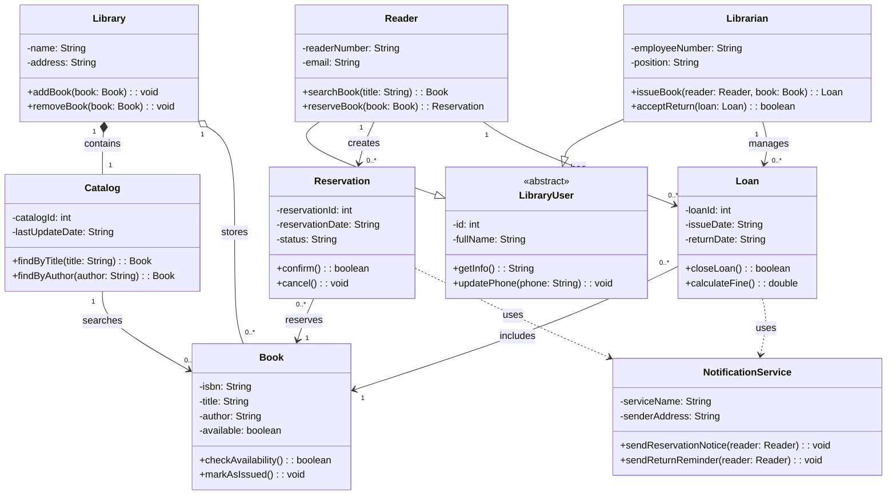

# Диаграмма классов: Библиотечная система

## Описание предметной области

Библиотечная система предназначена для автоматизации работы библиотеки.

Система позволяет читателям искать книги, бронировать книги, получать книги и возвращать их. Библиотекарь управляет фондом книг, оформляет выдачу и принимает возврат. Также система может отправлять уведомления читателям.

---

## Основные классы

- **LibraryUser** — общий абстрактный класс для пользователей библиотеки.
- **Reader** — читатель библиотеки.
- **Librarian** — библиотекарь.
- **Library** — библиотека, которая хранит каталог и книги.
- **Catalog** — каталог книг.
- **Book** — книга.
- **Reservation** — бронирование книги.
- **Loan** — выдача книги.
- **NotificationService** — сервис отправки уведомлений.

---

## Диаграмма Mermaid

---

## Пояснение к классам

### LibraryUser

`LibraryUser` — общий абстрактный класс для пользователей библиотеки. От него наследуются классы `Reader` и `Librarian`.

### Reader

`Reader` описывает читателя библиотеки. Читатель может искать книгу и создавать бронирование.

### Librarian

`Librarian` описывает библиотекаря. Библиотекарь может выдавать книги и принимать возврат.

### Library

`Library` описывает библиотеку. Она содержит каталог и хранит книги.

### Catalog

`Catalog` используется для поиска книг по названию или автору.

### Book

`Book` описывает книгу. У книги есть ISBN, название, автор и статус доступности.

### Reservation

`Reservation` описывает бронирование книги читателем.

### Loan

`Loan` описывает выдачу книги читателю.

### NotificationService

`NotificationService` используется для отправки уведомлений читателю.

---

## Пояснение к отношениям

### Наследование

`Reader` и `Librarian` наследуются от `LibraryUser`.

Это сделано потому, что читатель и библиотекарь являются пользователями библиотеки и имеют общие данные: идентификатор и ФИО.

### Композиция

`Library` содержит `Catalog`.

Используется композиция, потому что каталог является частью библиотеки. Если библиотека не рассматривается в системе, её каталог тоже не имеет самостоятельного смысла.

### Агрегация

`Library` хранит объекты `Book`.

Используется агрегация, потому что книги могут существовать как отдельные объекты, даже если библиотека перестанет их хранить.

### Ассоциация

`Reader` связан с `Reservation` и `Loan`.

Это означает, что один читатель может иметь много бронирований и много выдач.

### Зависимость

`Reservation` и `Loan` зависят от `NotificationService`.

Это означает, что бронирование и выдача могут использовать сервис уведомлений, но не являются его частью.

---

## Ответы на контрольные вопросы

### 1. Что такое диаграмма классов и для чего она используется?

Диаграмма классов — это UML-диаграмма, которая показывает статическую структуру системы.

Она используется для отображения классов, их атрибутов, методов и связей между классами.

### 2. Какие три основные секции имеет прямоугольник класса?

Прямоугольник класса обычно имеет три секции:

1. Имя класса.
2. Атрибуты класса.
3. Методы класса.

### 3. Что означают символы `+`, `-`, `#` перед атрибутами и методами?

Символ `+` означает public, то есть открытый доступ.

Символ `-` означает private, то есть закрытый доступ.

Символ `#` означает protected, то есть защищённый доступ.

### 4. Как в Mermaid обозначается наследование?

В Mermaid наследование обозначается стрелкой `--|>`.

Например, в данной работе `Reader --|> LibraryUser` означает, что класс `Reader` наследуется от класса `LibraryUser`.

### 5. В чём разница между агрегацией и композицией?

Агрегация — это слабая связь «часть-целое». Часть может существовать отдельно от целого.

Композиция — это сильная связь «часть-целое». Часть не может существовать без целого.

В данной работе `Library o-- Book` — это агрегация, потому что книги могут существовать отдельно от библиотеки.

`Library *-- Catalog` — это композиция, потому что каталог является частью библиотеки.

### 6. Как указать множественность отношения, например «один ко многим»?

Множественность указывается рядом со связью в кавычках.

Например, запись `Reader "1" --> "0..*" Loan` означает, что один читатель может иметь ноль или много выдач.

### 7. Как изобразить интерфейс в Mermaid?

Интерфейс в Mermaid можно изобразить как класс со стереотипом `<<interface>>`.

Например, внутри класса можно указать стереотип `<<interface>>`, чтобы показать, что это интерфейс.

### 8. Какую информацию можно указать в сигнатуре метода?

В сигнатуре метода можно указать:

- видимость метода;
- название метода;
- параметры метода;
- типы параметров;
- возвращаемый тип.

Например, метод `+reserveBook(book: Book): Reservation` означает открытый метод, который принимает параметр `book` типа `Book` и возвращает объект типа `Reservation`.