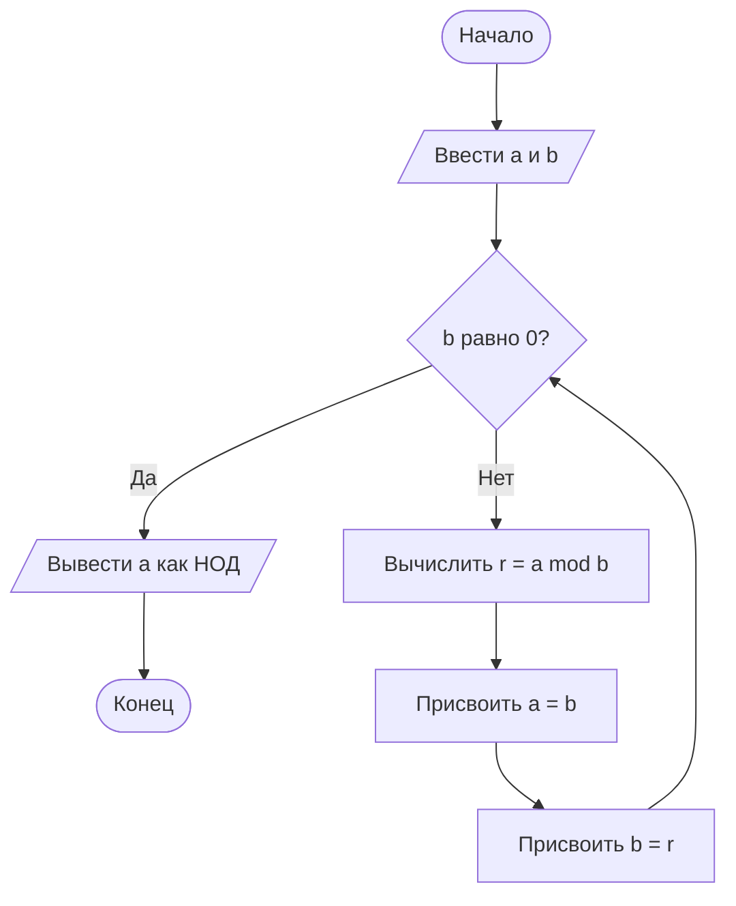

# Блок-схема алгоритма Евклида

## Описание алгоритма

Алгоритм Евклида используется для нахождения наибольшего общего делителя двух чисел.

Пользователь вводит два числа `a` и `b`. Пока `b` не равно нулю, вычисляется остаток от деления `a` на `b`. Затем `a` принимает значение `b`, а `b` принимает значение остатка. Когда `b` становится равно нулю, значение `a` является наибольшим общим делителем.

## Диаграмма Mermaid



## Код алгоритма на Python

```python
a = int(input("Введите первое число: "))
b = int(input("Введите второе число: "))

while b != 0:
    r = a % b
    a = b
    b = r

print("НОД:", a)
```

## Пояснение шагов

1. Вводятся два числа `a` и `b`.
2. Проверяется условие `b == 0`.
3. Если `b` равно нулю, выводится значение `a`.
4. Если `b` не равно нулю, вычисляется остаток `r = a % b`.
5. Значению `a` присваивается значение `b`.
6. Значению `b` присваивается значение `r`.
7. Проверка повторяется до тех пор, пока `b` не станет равно нулю.

---

## Ответы на контрольные вопросы

## Ответы на контрольные вопросы

### 1. Что такое Mermaid и для чего он используется?

Mermaid — это язык разметки для создания диаграмм и схем с помощью текстового описания. Он используется для построения блок-схем, диаграмм последовательности, диаграмм классов, диаграмм состояний и других схем.

### 2. Как вставить диаграмму в Markdown-документ?

Диаграмму Mermaid вставляют в Markdown-документ с помощью блока кода с указанием языка `mermaid`.

Внутри блока обязательно нужно указать тип диаграммы, например `flowchart TD`.

Полная Mermaid-диаграмма обычно выглядит так: сначала открывается блок с указанием `mermaid`, затем пишется `flowchart TD`, затем указываются узлы и стрелки, после этого блок закрывается.

### 3. Какие типы узлов доступны в блок-схемах Mermaid?

В Mermaid доступны разные типы узлов:

- `A[Текст]` — прямоугольник, процесс;
- `A(Текст)` — блок со скруглёнными углами;
- `A{Текст}` — ромб, условие;
- `A[/Текст/]` — параллелограмм, ввод или вывод;
- `A([Текст])` — овал, начало или конец;
- `A[(Текст)]` — цилиндр, данные или база данных.

### 4. Чем отличаются стрелки `-->` и `-- текст -->`?

Стрелка `-->` показывает обычный переход от одного узла к другому.

Пример обычной стрелки: `A --> B`.

Стрелка `-- текст -->` показывает переход с подписью.

Пример стрелки с подписью: `A -- Да --> B`.

### 5. Как изменить ориентацию диаграммы с вертикальной на горизонтальную?

Ориентация задаётся после слова `flowchart`.

Вертикальная диаграмма задаётся так: `flowchart TD`.

Горизонтальная диаграмма задаётся так: `flowchart LR`.

`TD` означает сверху вниз, а `LR` означает слева направо.

### 6. Зачем нужны подграфы `subgraph`?

Подграфы нужны для группировки нескольких узлов в один логический блок. Это удобно, если схема большая и её нужно разделить на части.

Пример подграфа можно записать так: `subgraph Проверка`, затем внутри указать узлы, например `A --> B`, и закрыть блок словом `end`.

### 7. Какие символы нельзя использовать в идентификаторах узлов?

В идентификаторах узлов не рекомендуется использовать пробелы и специальные символы. Лучше использовать латинские буквы, цифры и понятные имена без пробелов, например `Start`, `InputData`, `CheckNumber`.

### 8. Почему важно указывать начальный и конечный узлы?

Начальный и конечный узлы показывают, где алгоритм начинается и где завершается. Без них блок-схема будет менее понятной и может выглядеть незавершённой.